# Panduan dosen Lab 04 - Virtualisasi dan Container

**Jenis bukti visual:** foto Docker Desktop/Chrome adalah screenshot langsung. Kartu terminal adalah render keluaran perintah aktual yang ditata ulang. Setiap checkpoint A-E mempunyai gambar dan penjelasan perintah/fungsi/cara kerja/hasil; mahasiswa wajib mengambil screenshot miliknya sendiri untuk penilaian.

**COMP6991031 | Sesi 04 | Kasus operasional situs status internal.** Panduan ini mendampingi [modul mahasiswa dengan kunci A-E](MODUL_MAHASISWA.md). Sumber capaian: RPS COMP6991031 sesi 04 (LO2): VM/hypervisor, container vs VM, namespaces/cgroups, arsitektur Docker, image/container lifecycle; praktik Docker Desktop/Engine, pull nginx/Python/Node, port dan environment, `ps`/`stop`/`start`/`rm`, `exec`, log, dan cleanup. Bind mount digunakan sebagai demonstrasi data host versus image.

## Target praktik dan batas kelas

Mahasiswa dapat menjawab kapan memakai `stop/start`, kapan membuat container baru, bagaimana membaca `ps -a` dan log saat layanan gagal, serta mengapa edit file host dapat terlihat tanpa rebuild image. Kasus kerja harian yang digunakan: halaman status internal `cloudlab-site` pada 8088 mengalami outage; setelah dipulihkan, tim mengubah pengumuman insiden dan menjalankan canary di 8089 karena port utama sudah dipakai.

Perintah utama ditulis untuk **Windows PowerShell** di laptop; blok Bash/Linux/Codespaces tersedia di modul mahasiswa. Praktik VM di sesi ini konseptual sehingga tidak menuntut instalasi hypervisor kedua. Docker Desktop harus menampilkan **Engine running**. Port 8088/8089 perlu tersedia. Lakukan demo dari root repo dan jangan menayangkan `docker info` penuh karena dapat memuat detail host.

## Persiapan 15 menit sebelum kelas

1. Buka Docker Desktop, verifikasi `docker version` dan `docker info --format '{{.ServerVersion}}'`.
2. Periksa `docker ps -a --filter name=cloudlab-` dan port 8088/8089. Bila ada container latihan **milik demo sebelumnya**, dokumentasikan dahulu lalu hapus hanya nama `cloudlab-nginx`, `cloudlab-site`, atau `cloudlab-canary` sesuai kebutuhan.
3. Pastikan `site/index.html`, `tests/challenge.ps1`, `tests/challenge.sh`, modul PDF, dan screenshot dapat dibuka. Ambil satu screenshot asli dari mesin dosen sebagai orientasi; mahasiswa tetap harus menghasilkan bukti pribadi.
4. Jika Internet lambat, tarik `nginx:alpine`, `python:3.12-alpine`, `node:22-alpine` lebih awal. Perubahan tag/versi patch bisa membuat angka ID berbeda; konsepnya tetap sama.
5. Pastikan satu terminal PowerShell pada root repo dan Chrome untuk `http://127.0.0.1:8088/`. Docker Desktop tab Containers dibuka agar status Up/Exited terlihat saat demo.

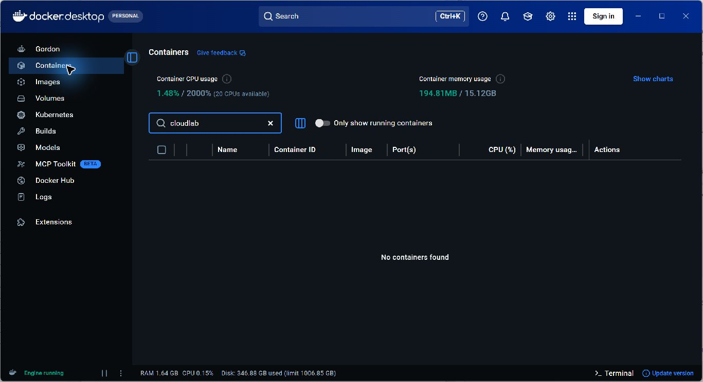

*Langkah: tunjukkan Engine running dan jalankan `docker version`. Fungsi: menghindari peserta mengira kegagalan daemon sebagai kesalahan kode. Cara kerja: CLI menghubungi daemon; jika server tidak menjawab, praktik belum siap. Baca hasil: versi client/server tersedia.*

## Alokasi 100 menit (usulan, bukan durasi resmi RPS)

| Menit | Aktivitas dan pertanyaan dosen | Bukti cepat |
|---|---|---|
| 0-10 | Gambar VM (host + hypervisor + guest OS) versus container (kernel host bersama); jelaskan namespaces/cgroups dan client-daemon-registry. | Dua mahasiswa menjelaskan image vs container. |
| 10-25 | Pull tiga image; inspect ID; jalankan Python/Node sekali pakai dan `-e CLASS_SECTION=cloud`. | Ketiga image ada, output `cloud`. |
| 25-40 | Run nginx bawaan pada 8088, HTTP 200, `ps`, `logs`, `exec`. | Port `127.0.0.1:8088->80/tcp`. |
| 40-50 | Stop, `ps` vs `ps -a`, start, stop, rm. | Exited lalu Up dengan nama container sama. |
| 50-60 | Deploy `cloudlab-site` dari bind mount read-only; baca metadata RW=false. | Halaman awal dan HTTP 200. |
| 60-80 | Challenge C dan D: outage terkontrol, diagnosis, pemulihan, hotfix pengumuman tanpa rebuild. | HTTP gagal lalu 200; image ID sama. |
| 80-90 | Challenge E: bentrokan 8088, jalankan canary 8089. | Dua container Up dan HTTP 200 di dua port. |
| 90-100 | Jalankan challenge A-E, simpulkan pembelajaran, simpan laporan/Git, cleanup. | Semua PASS dan screenshot hasil mahasiswa. |

## Demo persis dan ekspektasi

### A - image, proses sekali pakai, environment

```powershell
docker pull nginx:alpine
docker pull python:3.12-alpine
docker pull node:22-alpine
docker image ls nginx
docker image ls python
docker image ls node
docker image inspect nginx:alpine --format '{{.Id}}'
docker run --rm python:3.12-alpine python --version
docker run --rm node:22-alpine node --version
docker run --rm -e CLASS_SECTION=cloud python:3.12-alpine sh -c 'echo "$CLASS_SECTION"'
```

Jelaskan bahwa `pull` mengunduh image, `run` membuat container dari image, `--rm` menghapus container setelah proses keluar, dan `-e` hanya berlaku pada proses tersebut. Jangan menerima jawaban “image sedang berjalan”; **container** yang berjalan, image adalah paket pembentuknya. Minta mahasiswa menebak apakah mengubah file HTML nanti mengubah image ID (jawaban: tidak).

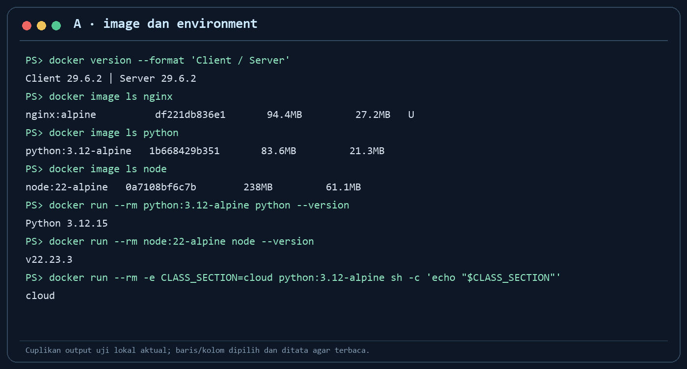

*Langkah: tarik tiga image dan jalankan `-e CLASS_SECTION=cloud`. Fungsi: memperlihatkan tugas cepat terisolasi. Cara kerja: daemon membuat container sekali pakai dari image Python dan menyuntikkan variabel. Baca hasil: versi Python/Node dan `cloud`.*

Jalankan checker awal setelah image tersedia. Pada mesin demo, hasilnya `3 PASS, 11 FAIL` karena situs belum dibuat. Jelaskan bahwa FAIL tersebut adalah daftar tugas, bukan masalah instalasi Docker. Minta mahasiswa membaca hint sebelum mengubah apa pun.

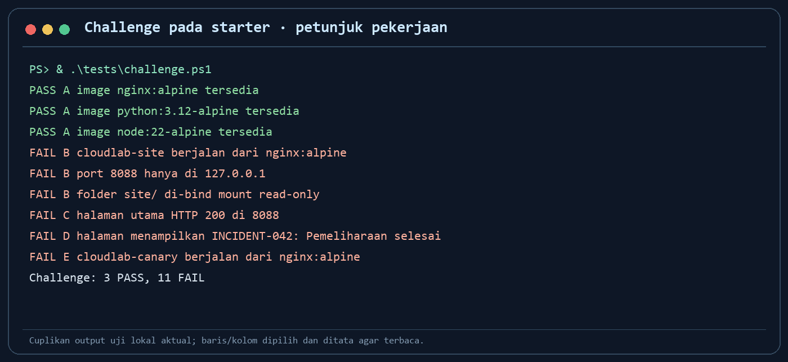

*Langkah: jalankan `& .\tests\challenge.ps1` atau Bash checker dari terminal yang sesuai. Fungsi: menunjukkan syarat A-E sebelum praktik. Cara kerja: checker membaca keadaan Docker/HTTP tanpa memperbaiki apa pun. Baca hasil: tiga image PASS, pekerjaan B-E FAIL dengan hint; angka awal bisa berubah bila image belum di-pull.*

### B - layanan awal, port, log, exec

```powershell
docker run --name cloudlab-nginx -d -p 127.0.0.1:8088:80 nginx:alpine
docker ps --filter name=cloudlab-nginx
curl.exe -I http://127.0.0.1:8088/
docker logs --tail 10 cloudlab-nginx
docker exec cloudlab-nginx sh -c 'hostname; ls /usr/share/nginx/html'
```

Tunjuk arah port: `127.0.0.1` alamat host lokal, `8088` host, `80` Nginx di container. Opsi loopback menghindari publikasi ke seluruh antarmuka host. `logs` memperlihatkan request, sedangkan `exec` menjalankan inspeksi pada container yang hidup. HTTP 200 membuktikan layanan merespons; bukan bukti isi aplikasi benar.


*Langkah: run, ps, curl. Fungsi: cek konektivitas ke container. Cara kerja: Docker meneruskan 8088 host ke 80 container. Baca hasil: Up, port mapping, HTTP 200.*

### Siklus hidup - stop, start, remove

```powershell
docker stop cloudlab-nginx
docker ps --filter name=cloudlab-nginx
docker ps -a --filter name=cloudlab-nginx
docker start cloudlab-nginx
docker ps --filter name=cloudlab-nginx
docker stop cloudlab-nginx
docker rm cloudlab-nginx
```

Minta peserta membaca `Exited` saat `ps -a` dan memprediksi hasil `docker start`. Tegaskan `stop` mempertahankan objek container, `rm` menghapusnya, dan keduanya tidak menghapus image. Penghapusan nama ini membebaskan 8088 untuk `cloudlab-site`.

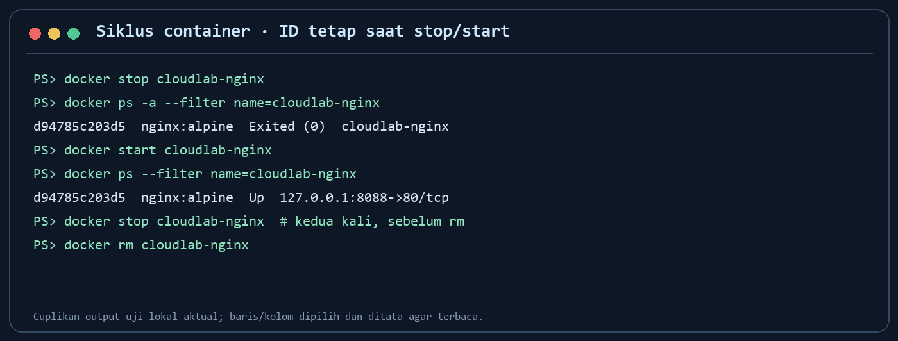

*Langkah: `stop`, `ps -a`, `start`. Fungsi: membandingkan proses berhenti dengan container terhapus. Cara kerja: daemon mengubah state container yang sama. Baca hasil: Exited menjadi Up tanpa pull/build image baru.*

### Situs kasus - bind mount yang dapat diaudit

Jalankan dari root repo di PowerShell:

```powershell
$siteDir = Join-Path (Get-Location).Path 'site'
$mount = "type=bind,source=$siteDir,target=/usr/share/nginx/html,readonly"
docker run --name cloudlab-site -d -p 127.0.0.1:8088:80 --mount $mount nginx:alpine
docker inspect cloudlab-site --format '{{range .Mounts}}{{.Type}} {{.Destination}} RW={{.RW}}{{end}}'
docker port cloudlab-site 80
curl.exe -I http://127.0.0.1:8088/
```

Sebelum membuka Chrome, tanya “file mana milik host, folder mana milik container, dan siapa yang boleh menulisnya?” Jawaban: `site/index.html` di host, `/usr/share/nginx/html` di container, `RW=false` berarti Nginx tidak dapat menulis melalui mount. Halaman awal berisi `STATUS_OK: Layanan normal`.

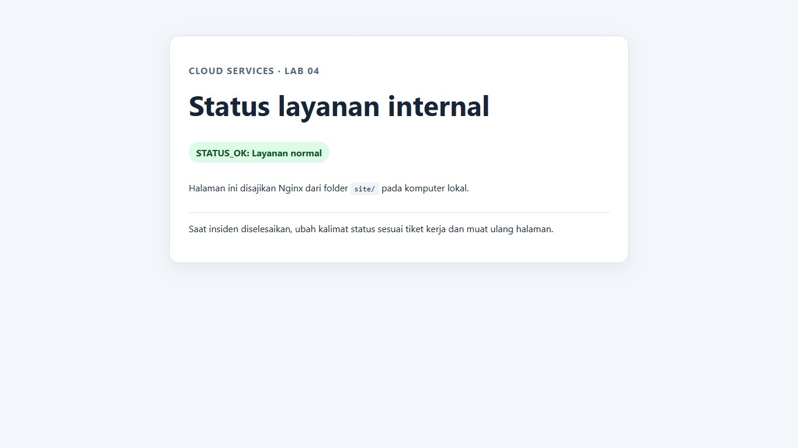

*Langkah: buka 8088 setelah bind mount. Fungsi: menyajikan file host sebagai halaman layanan. Cara kerja: Nginx membaca file pada request berikutnya. Baca hasil: status awal dan HTTP 200.*

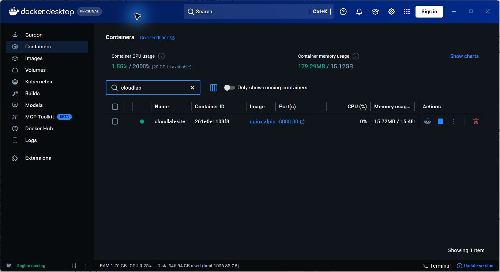

*Langkah: inspeksi `docker ps`, `docker port`, dan `docker inspect`. Fungsi: memvalidasi state serta mode mount. Cara kerja: metadata runtime berasal dari daemon, bukan dari dugaan terhadap argumen awal. Baca hasil: cloudlab-site Up, 8088 ke 80, bind `RW=false`.*

## Kunci challenge C - outage dan recovery

```powershell
docker stop cloudlab-site
curl.exe -I http://127.0.0.1:8088/
docker ps --filter name=cloudlab-site
docker ps -a --filter name=cloudlab-site
docker logs --tail 10 cloudlab-site
docker start cloudlab-site
curl.exe -I http://127.0.0.1:8088/
```

Hasil curl pertama **gagal secara sengaja**. `ps` kosong dan `ps -a` menunjukkan Exited. Log mungkin tidak memuat error baru karena proses memang dihentikan; itu observasi yang valid. `start` mempertahankan container, mount, dan port lalu HTTP kembali 200. Pertanyaan diskusi: “Kapan `start` tidak cukup?” Jawaban: jika konfigurasi container salah, image rusak, atau file sumber hilang, perlu memperbaiki penyebab dan mungkin membuat ulang container; log dan inspect memberi petunjuk.

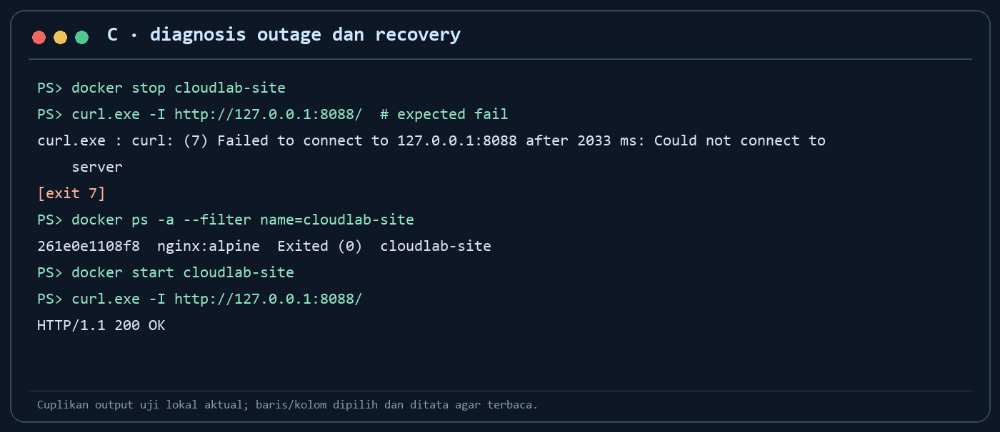

*Langkah: stop, curl gagal, ps/ps-a/log, start, curl berhasil. Fungsi: latihan respons insiden. Cara kerja: port berhenti menerima request saat Nginx mati, lalu aktif lagi dengan container sama. Baca hasil: Exited dan connection failed berubah menjadi Up dan HTTP 200.*

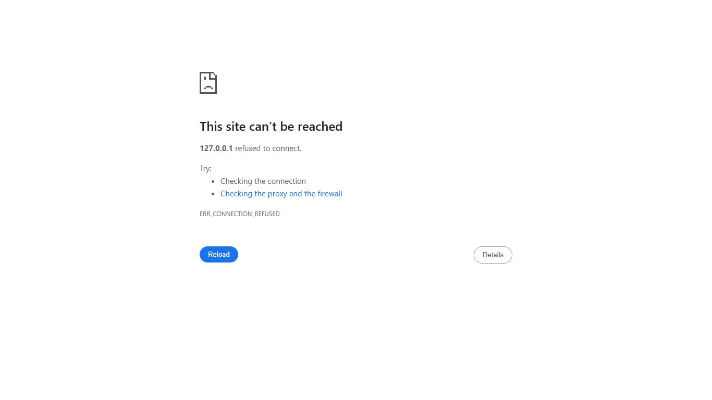

*Langkah: refresh Chrome setelah `docker stop cloudlab-site`. Fungsi: menunjukkan dampak outage pada pengguna. Cara kerja: host 8088 tidak lagi punya listener. Baca hasil: `ERR_CONNECTION_REFUSED`; bandingkan dengan HTTP 200 setelah `start`.*


*Langkah: lihat tab Containers setelah stop. Fungsi: mengaitkan error browser dengan state runtime. Cara kerja: Desktop mengambil state dari daemon. Baca hasil: indikator berhenti/tombol Start dan `Exited` pada `docker ps -a`.*

## Kunci challenge D - hotfix tanpa rebuild

Ikuti blok PowerShell lengkap dalam modul mahasiswa untuk mengganti `STATUS_OK: Layanan normal` dengan `INCIDENT-042: Pemeliharaan selesai`. Alternatif editor VS Code: buka `site/index.html`, ganti kalimat, simpan, refresh Chrome. Sebelum dan sesudah, catat:

```powershell
docker image inspect nginx:alpine --format '{{.Id}}'
curl.exe -fsS http://127.0.0.1:8088/ | Select-String 'INCIDENT-042'
docker inspect cloudlab-site --format '{{range .Mounts}}{{.Destination}} RW={{.RW}}{{end}}'
```

Hasil yang benar: halaman berubah, image ID tetap, container yang sama tetap Up, mount tetap `RW=false`. Bind mount memungkinkan hotfix konten; untuk sistem produksi, perubahan harus tetap direview dan dicatat di Git, sebab edit host tanpa audit dapat menimbulkan drift.

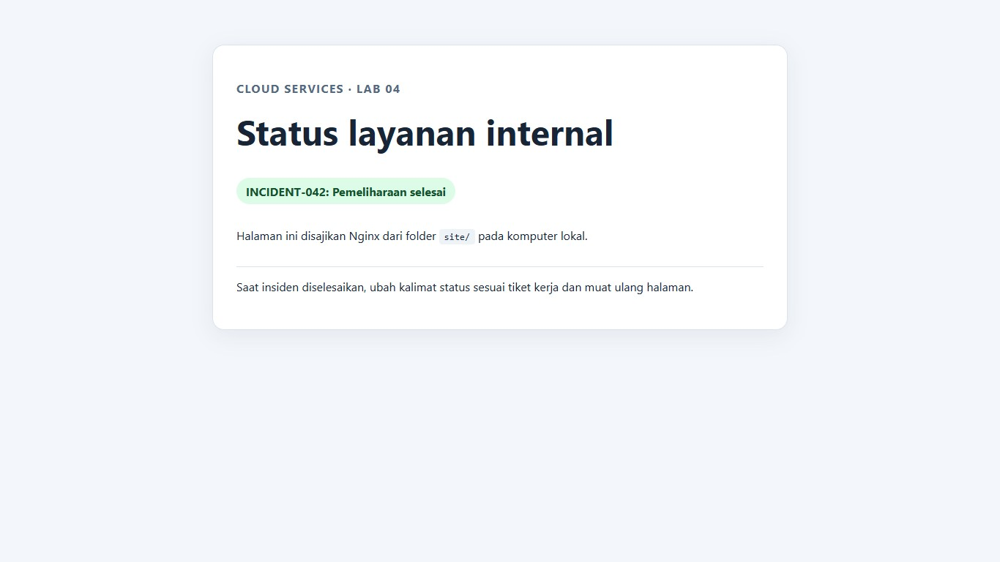

*Langkah: edit `site/index.html` dan refresh. Fungsi: menunjukkan pemisahan konten host dari image. Cara kerja: Nginx membaca file host terbaru tanpa build/pull. Baca hasil: token INCIDENT-042 tampil dan image ID tidak berubah.*

## Kunci challenge E - bentrokan port dan canary

```powershell
docker run --name cloudlab-canary -d -p 127.0.0.1:8088:80 nginx:alpine
docker ps -a --filter name=cloudlab-canary
docker rm -f cloudlab-canary
docker run --name cloudlab-canary -d -p 127.0.0.1:8089:80 nginx:alpine
docker ps --filter name=cloudlab-
curl.exe -I http://127.0.0.1:8088/
curl.exe -I http://127.0.0.1:8089/
```

Error pada run pertama **diinginkan**: host port 8088 telah digunakan situs utama. Jika objek canary tidak dibuat, `rm -f` bisa menampilkan No such container dan langkah tetap dapat dilanjutkan. Mapping 8089:80 memungkinkan kedua container memakai port internal 80 masing-masing. Jangan hentikan situs utama hanya agar canary bisa memakai 8088, karena itu justru memperpanjang outage.

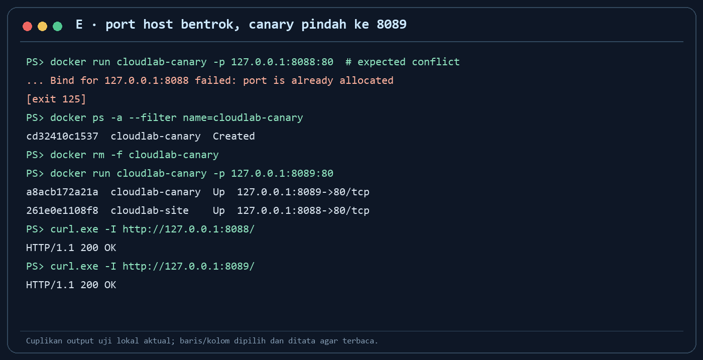

*Langkah: run di 8088 gagal, lalu run di 8089. Fungsi: memahami port host unik dan namespace jaringan container. Cara kerja: host menolak bind kedua ke 8088; 8089 menyediakan alamat host lain menuju port 80 container kedua. Baca hasil: dua container Up, keduanya HTTP 200.*

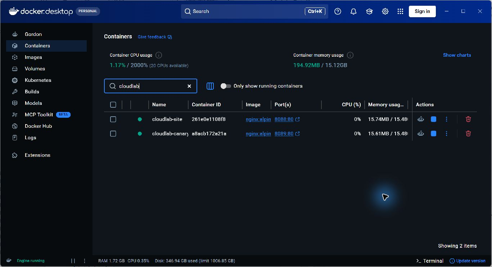

*Langkah: lihat tab Containers setelah canary 8089 hidup. Fungsi: memastikan situs utama tidak terganggu. Cara kerja: daemon mempertahankan dua container dengan port internal 80 dan port host berbeda. Baca hasil: cloudlab-site pada 8088 dan cloudlab-canary pada 8089.*

## Pemeriksaan, penilaian, dan Git

Jalankan salah satu dari root repo saat `cloudlab-site` dan `cloudlab-canary` masih hidup:

```powershell
& .\tests\challenge.ps1
```

```bash
bash tests/challenge.sh
```

Skrip mengecek **state akhir** A-E tanpa memperbaiki peserta. Screenshot outage, stop/start, dan port conflict tetap wajib karena state akhir tidak membuktikan kejadian historis. Gunakan [templat laporan](hasil/TEMPLATE_LAPORAN.md) untuk menilai alasan teknis, bukan hanya jumlah PASS. Contoh rubrik 10 poin formatif: 2 VM/image/container, 2 image+env, 2 port+read-only mount, 2 diagnosis/recovery+hotfix, 2 canary+laporan/Git. Bobot resmi mata kuliah tetap mengikuti RPS.

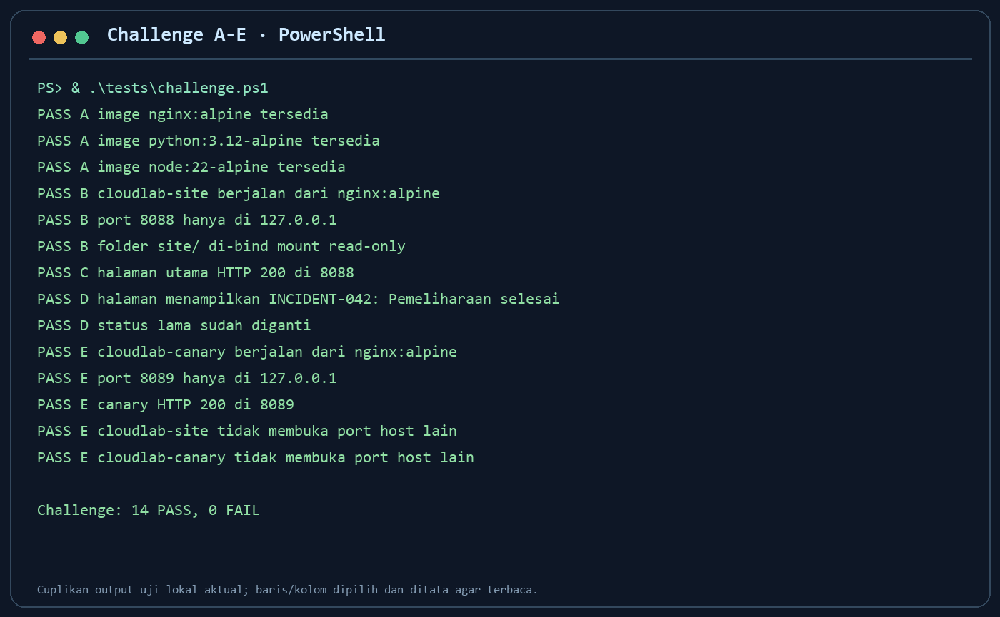

*Langkah: jalankan skrip challenge. Fungsi: cek hasil yang dapat diulang dosen. Cara kerja: skrip membaca metadata Docker dan HTTP lokal, memberi PASS/FAIL dengan hint. Baca hasil: semua A-E PASS; bukti proses tetap dari screenshot mahasiswa.*

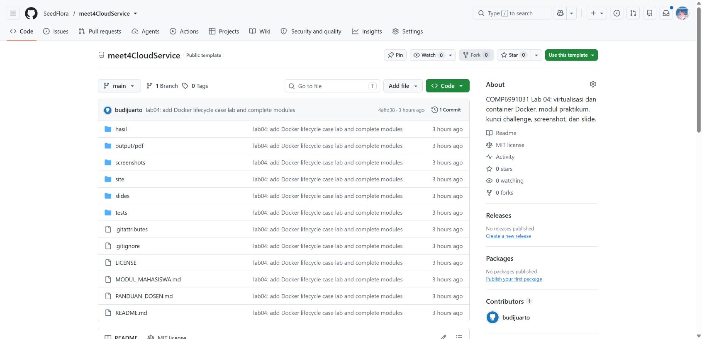

*Langkah: minta mahasiswa membuka repo pribadinya setelah `git push`. Fungsi: membuktikan pekerjaan tersedia untuk diperiksa dosen. Cara kerja: GitHub menampilkan branch `main`, commit terakhir, dan file hasil; gambar ini berasal dari repo template dosen sebagai contoh posisi elemen UI. Cocokkan commit mahasiswa dengan laporan dan screenshot pribadinya, lalu jalankan `docker ps -a --filter name=cloudlab-` untuk memastikan cleanup hanya menyentuh container lab.*

Laporan mahasiswa harus menjelaskan fungsi tiap perintah penting, hasil sebenarnya, dan apa yang dilakukan saat hasil berbeda. Buka `git diff --cached --name-only` sebelum commit untuk memastikan tidak ada data host, token, atau output `docker info` penuh. Repo mahasiswa menyimpan `site/index.html`, `hasil/lab04.md`, dan screenshot **milik mahasiswa**. Image Docker tidak perlu dipush ke registry.

## Tanya jawab cepat dan troubleshooting

| Pertanyaan/gejala | Jawaban atau arah pemeriksaan |
|---|---|
| “Mengapa `docker ps` kosong tetapi nama masih terpakai?” | Container berhenti masih ada; lihat `docker ps -a`, lalu `start` atau `rm` sesuai kebutuhan. |
| “Mengapa edit HTML langsung muncul?” | Bind mount menghubungkan folder host ke folder yang dibaca Nginx. Image ID tetap. |
| “Mengapa `RW=false`?” | Container membaca konten, tetapi tidak diberi hak tulis melalui mount. |
| “Mengapa 8088 bentrok tetapi 80 di dua container tidak?” | 8088 adalah resource host tunggal; tiap container punya namespace jaringan sendiri. |
| “Mengapa browser Codespaces memakai HTTPS saat lab kita HTTP?” | Forwarding Codespaces bisa berlapis HTTPS; HTTP/TLS di Nginx harus dibuktikan terpisah. Lab 04 fokus port dan lifecycle, bukan konfigurasi TLS. |
| `docker version` gagal | Docker Desktop/Engine belum aktif; periksa status Engine. |
| `--mount` error | Jalankan dari root repo, cek folder `site/`, gunakan kutip lengkap pada argumen `--mount`. |
| PowerShell menolak `.ps1` | Gunakan Bash test di Git Bash/WSL, atau bantu sesuai kebijakan komputer kampus. |

Setelah bukti tersimpan, `docker rm -f cloudlab-canary cloudlab-site` hanya untuk container lab. `docker ps -a --filter name=cloudlab-` harus kosong. Image dan file host tetap tersedia. Jangan membersihkan container lain milik mahasiswa atau proyek lain.
