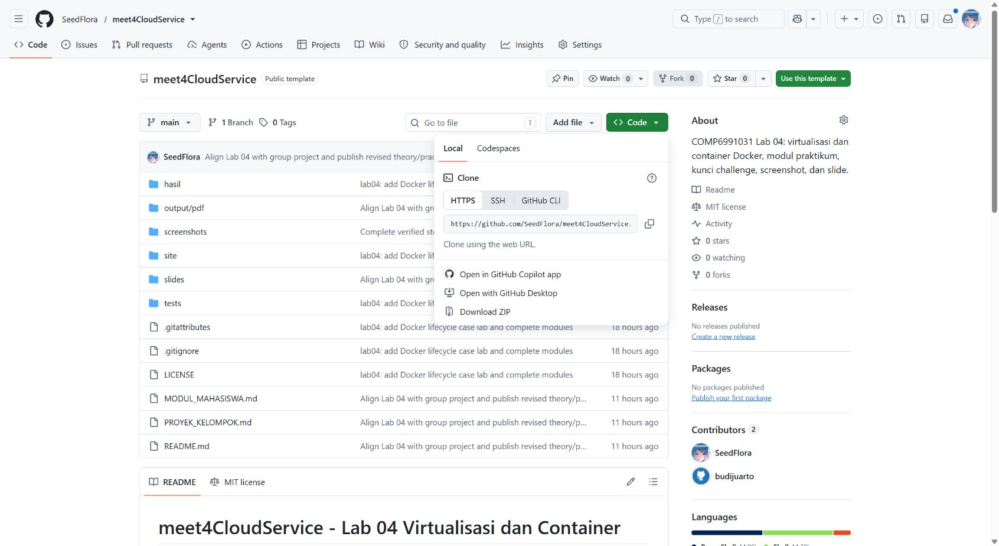

# meet4CloudService - Lab 04 Virtualisasi dan Container

<!-- lecture-materials:start -->

## Materi teori sebelum praktikum

- [Pertemuan 04: Virtualization & Containers](slides/Teori_Pertemuan_04.pptx)

Slide menghubungkan konsep, kasus kerja, bacaan/video resmi, dan langkah lab.

<!-- lecture-materials:end -->

**Kebijakan kelas:** Lab ini latihan formatif, tanpa tugas, nilai, atau penyerahan terpisah. Satu proyek besar dikerjakan oleh kelompok **3 orang**, dengan presentasi checkpoint minggu 7 (UTS) dan hasil akhir minggu 14 (UAS). Simpan hasil lab hanya bila berguna sebagai referensi atau bukti proses proyek. Baca [brief proyek kelompok](PROYEK_KELOMPOK.md). Bobot resmi tetap mengikuti RPS/LMS.

Praktikum COMP6991031. Kasus kerja: tim operasi menjalankan halaman status internal dengan Docker, mendiagnosis layanan yang berhenti, memperbarui pengumuman tanpa rebuild image, dan mengatasi bentrokan port. Semua langkah utama menggunakan Docker CLI dan dapat dicoba pada Docker Desktop di Windows.

**Mulai dari [modul mahasiswa lengkap dengan kunci challenge](MODUL_MAHASISWA.md).** Versi cetak: [PDF modul mahasiswa](output/pdf/MODUL_MAHASISWA_LAB04.pdf). [Slide praktikum](slides/LAB04_Docker_Lifecycle_Praktikum.pptx) tersedia untuk meninjau demonstrasi kelas.

## Mulai dari komputer kampus Windows

Gunakan Git dan Docker Desktop dengan **Linux Engine** yang sudah disiapkan kampus. Buka Docker Desktop hingga Engine running; pada PowerShell, `git --version`, `docker version` (Client + Server), dan `docker info --format '{{.OSType}}'` (linux) memeriksa prasyarat. Untuk PC yang belum mempunyai repo:

```powershell
$campusFolder = Join-Path ([Environment]::GetFolderPath('MyDocuments')) 'CloudServices'
New-Item -ItemType Directory -Path $campusFolder -Force | Out-Null
Set-Location -LiteralPath $campusFolder
git clone https://github.com/SeedFlora/meet4CloudService.git
Set-Location -LiteralPath 'meet4CloudService'
Get-Location
Get-ChildItem -LiteralPath 'site/index.html', 'tests/challenge.ps1', 'tests/challenge.sh'
git remote -v
```

Terminal sekarang di **root repo meet4CloudService**. Lanjutkan bagian Mulai cepat di bawah; [modul bagian 0](MODUL_MAHASISWA.md#0-mulai-dari-komputer-kampus-dan-clone-repo) menjelaskan command dan checkpoint. Lab 04 memakai image tersedia melalui **docker pull/run** dan halaman `site/index.html` melalui bind mount.



**Command / langkah:** `Code > Local > HTTPS` dan `git clone https://github.com/SeedFlora/meet4CloudService.git`. **Fungsi/cara kerja:** ambil URL sumber lalu clone kode/riwayat ke folder lokal dengan .git dan origin. **Baca:** screenshot menu GitHub repo pengajar; URL lengkap tersedia pada command. Validasi PowerShell/file dilakukan di PC Anda, bukan ditunjukkan oleh screenshot GitHub ini.

Jika folder repo sudah ada, masuk folder tersebut, periksa `git remote -v` dan `git status --short`, lalu gunakan `git pull --ff-only` **hanya ketika status bersih**. Tinjau perubahan lokal/history berbeda; jangan overwrite atau reset paksa. Clone publik cukup untuk praktik formatif, **tidak perlu git init atau push ke repo pengajar**. Clone dan pull image pertama memerlukan internet; setelah image tersedia, praktik web lokal dapat dijalankan melalui localhost. Jika instalasi/Engine dibatasi pengelola PC, gunakan lingkungan Codespaces dengan daemon Docker yang siap dan blok Bash pada modul.

## Repo pribadi atau kelompok — opsional

Jika ingin menyimpan kontribusi proyek kelompok, buat repo milik Anda lewat **Use this template → Create a new repository**. Clone URL HTTPS dari repo baru dan periksa origin milik Anda sebelum push. Catatan/screenshot pribadi boleh disimpan sebagai referensi, tanpa tugas atau penyerahan per lab. Proyek tetap kelompok **3 orang**, presentasi minggu **7/14**. Codespaces dapat dibuka dari **Code → Codespaces** pada repo publik untuk demo atau repo sendiri untuk proyek; gunakan URL Ports 8088/8089 untuk browser dan ikuti blok Bash.

## Yang dipelajari

- Membedakan VM, image, dan container; memahami Docker client, daemon, registry, namespaces, dan cgroups.
- Mengunduh dan memeriksa image `nginx:alpine`, `python:3.12-alpine`, dan `node:22-alpine`.
- Memakai `run`, `ps`, `logs`, `exec`, `stop`, `start`, dan `rm` untuk operasi harian.
- Memetakan port host `127.0.0.1:8088` ke port container `80`, memakai environment variable, dan memasang folder `site/` sebagai bind mount read-only.
- Menangani outage, hotfix konten, dan bentrokan port 8088 dengan canary di 8089.

## Mulai cepat - Windows PowerShell

Pastikan Docker Desktop menampilkan **Engine running** pada Linux Engine. Dari root repo hasil clone, periksa nama/port melalui `docker ps`; port 8088/8089 harus tersedia untuk alur standar. Lalu:

```powershell
docker version
docker pull nginx:alpine
docker pull python:3.12-alpine
docker pull node:22-alpine
```

Lanjutkan urutan penuh dalam [modul mahasiswa](MODUL_MAHASISWA.md). Perintah bind mount Windows PowerShell dan Bash/Linux ditulis terpisah agar path dengan spasi tetap aman. Setelah challenge A-E, jalankan `& .\tests\challenge.ps1` di PowerShell atau `bash tests/challenge.sh` di Linux/Codespaces/Git Bash.

## Hasil dan keselamatan data

Catatan opsional dapat memakai [templat laporan](hasil/TEMPLATE_LAPORAN.md) dengan output/screenshot **milik sendiri**; tidak ada kewajiban laporan, repo pribadi, atau push per lab. Setiap langkah bernomor memuat bukti visual dan penjelasan command/fungsi/cara kerja/hasil. Foto Chrome/Docker Desktop adalah screenshot langsung; kartu terminal adalah output aktual yang ditata ulang. Cleanup hanya untuk container lab bernama `cloudlab-nginx`, `cloudlab-site`, dan `cloudlab-canary`. Jangan commit output penuh `docker info`, token, atau data pribadi. Tidak perlu push image ke registry.

Rujukan: [Docker container](https://docs.docker.com/get-started/docker-concepts/the-basics/what-is-a-container/), [bind mount](https://docs.docker.com/engine/storage/bind-mounts/), [Docker CLI](https://docs.docker.com/reference/cli/docker/).

Rujukan persiapan: [clone GitHub](https://docs.github.com/en/repositories/creating-and-managing-repositories/cloning-a-repository), [Docker Desktop Windows](https://docs.docker.com/desktop/setup/install/windows-install/), [Docker pull](https://docs.docker.com/reference/cli/docker/image/pull/).
