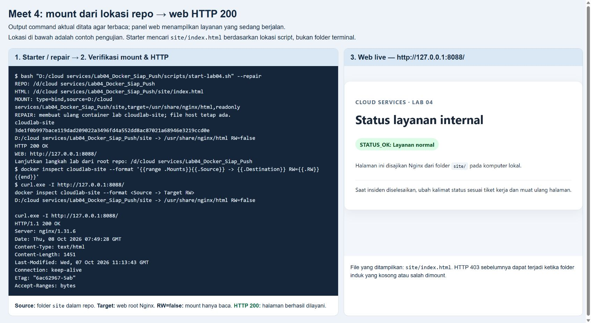

# meet4CloudService - Lab 04 Virtualisasi dan Container

<!-- lecture-materials:start -->

## Materi teori sebelum praktikum

- [Pertemuan 04: Virtualization & Containers](slides/Teori_Pertemuan_04.pptx)

Slide menghubungkan konsep, kasus kerja, bacaan/video resmi, dan langkah lab.

<!-- lecture-materials:end -->

**Kebijakan kelas:** Lab ini latihan formatif, tanpa tugas, nilai, atau penyerahan terpisah. Satu proyek besar dikerjakan oleh kelompok **3 orang**, dengan presentasi checkpoint minggu 7 (UTS) dan hasil akhir minggu 14 (UAS). Simpan hasil lab hanya bila berguna sebagai referensi atau bukti proses proyek. Baca [brief proyek kelompok](PROYEK_KELOMPOK.md). Bobot resmi tetap mengikuti RPS/LMS.

Praktikum COMP6991031. Kasus kerja: tim operasi menjalankan halaman status internal dengan Docker, mendiagnosis layanan yang berhenti, memperbarui pengumuman tanpa rebuild image, dan mengatasi bentrokan port. Semua langkah utama menggunakan Docker CLI dan dapat dicoba pada Docker Desktop di Windows.

**Mulai dari [modul mahasiswa lengkap dengan kunci challenge](MODUL_MAHASISWA.md).** Versi cetak: [PDF modul mahasiswa](output/pdf/MODUL_MAHASISWA_LAB04.pdf). [Slide praktikum](slides/LAB04_Docker_Lifecycle_Praktikum.pptx) tersedia untuk meninjau demonstrasi kelas.

## Mulai dari komputer kampus Windows

Gunakan Git dan Docker Desktop dengan **Linux Engine** yang sudah disiapkan kampus. Buka Docker Desktop hingga Engine running; pada PowerShell, `git --version`, `docker version` (Client + Server), dan `docker info --format '{{.OSType}}'` (linux) memeriksa prasyarat. Repo boleh berada di folder pribadi mana pun yang dapat ditulis, termasuk path dengan spasi. **Documents berikut hanya contoh lokasi clone**, bukan syarat lab. Untuk PC yang belum mempunyai repo:

```powershell
$campusFolder = Join-Path ([Environment]::GetFolderPath('MyDocuments')) 'CloudServices'
New-Item -ItemType Directory -Path $campusFolder -Force | Out-Null
Set-Location -LiteralPath $campusFolder
git clone https://github.com/SeedFlora/meet4CloudService.git
Set-Location -LiteralPath 'meet4CloudService'
Get-Location
Get-ChildItem -LiteralPath 'site/index.html', 'scripts/start-lab04.ps1', 'tests/challenge.ps1'
git remote -v
```

Terminal sekarang di **root repo meet4CloudService**, yaitu folder yang langsung berisi `site/`, `scripts/`, dan `tests/`. Jika folder kerja luar juga memiliki `site/`, jangan pilih folder luar itu. Pada VS Code gunakan **File → Open Folder → pilih repo sebenarnya**, lalu **Terminal → New Terminal**. Lanjutkan bagian Mulai cepat di bawah; [modul bagian 0](MODUL_MAHASISWA.md#0-mulai-dari-komputer-kampus-dan-clone-repo) menjelaskan command dan checkpoint. Lab 04 memakai image tersedia melalui **docker pull/run** dan halaman `site/index.html` melalui bind mount.


**Command / langkah:** `Code > Local > HTTPS` dan `git clone https://github.com/SeedFlora/meet4CloudService.git`. **Fungsi/cara kerja:** ambil URL sumber lalu clone kode/riwayat ke folder lokal dengan .git dan origin. **Baca:** screenshot menu GitHub repo pengajar; URL lengkap tersedia pada command. Validasi PowerShell/file dilakukan di PC Anda, bukan ditunjukkan oleh screenshot GitHub ini.

Jika folder repo sudah ada, masuk folder tersebut, periksa `git remote -v` dan `git status --short`, lalu gunakan `git pull --ff-only` **hanya ketika status bersih**. Tinjau perubahan lokal/history berbeda; jangan overwrite atau reset paksa. Clone publik cukup untuk praktik formatif, **tidak perlu git init atau push ke repo pengajar**. Clone dan pull image pertama memerlukan internet; setelah image tersedia, praktik web lokal dapat dijalankan melalui localhost. Jika instalasi/Engine dibatasi pengelola PC, gunakan lingkungan Codespaces dengan daemon Docker yang siap dan blok Bash pada modul.

## Repo pribadi atau kelompok — opsional

Jika ingin menyimpan kontribusi proyek kelompok, buat repo milik Anda lewat **Use this template → Create a new repository**. Clone URL HTTPS dari repo baru dan periksa origin milik Anda sebelum push. Catatan/screenshot pribadi boleh disimpan sebagai referensi, tanpa tugas atau penyerahan per lab. Proyek tetap kelompok **3 orang**, presentasi minggu **7/14**. Codespaces dapat dibuka dari **Code → Codespaces** pada repo publik untuk demo atau repo sendiri untuk proyek; gunakan URL Ports 8088/8089 untuk browser dan ikuti blok Bash.

## Yang dipelajari

- Membedakan VM, image, dan container; memahami Docker client, daemon, registry, namespaces, dan cgroups.
- Mengunduh dan memeriksa image `nginx:alpine`, `python:3.12-alpine`, dan `node:22-alpine`.
- Memakai `run`, `ps`, `logs`, `exec`, `stop`, `start`, dan `rm` untuk operasi harian.
- Memetakan port host `127.0.0.1:8088` ke port container `80`, memakai environment variable, dan memasang folder `site/` sebagai bind mount read-only.
- Menangani outage, hotfix konten, dan bentrokan port 8088 dengan canary di 8089.

## Mulai cepat - starter dari lokasi folder mana pun

Pastikan Docker Desktop menampilkan **Engine running** pada Linux Engine. Pilih **satu** command sesuai lokasi terminal; semua starter menghitung root repo dari **lokasi file script**, sehingga tidak bergantung pada `Get-Location`/`pwd` atau variabel `$mount` lama.

**PowerShell, terminal berada di root repo:**

```powershell
& .\scripts\start-lab04.ps1 -Repair
```

**PowerShell, terminal berada di folder induk yang berisi meet4CloudService:**

```powershell
& .\meet4CloudService\scripts\start-lab04.ps1 -Repair
```

Dari lokasi lain, salin path lengkap `scripts/start-lab04.ps1` dari Explorer/VS Code dan panggil dengan `&` serta tanda kutip, misalnya `& 'PATH_LENGKAP_REPO_ANDA\scripts\start-lab04.ps1' -Repair`. **Ganti placeholder dengan path file yang benar**; nama folder/spasi boleh berbeda pada setiap PC.

**Git Bash/Linux/Codespaces, dari root repo:**

```bash
bash scripts/start-lab04.sh --repair
```

Dari folder induk gunakan `bash "meet4CloudService/scripts/start-lab04.sh" --repair`; dari lokasi lain gunakan path lengkap file script dalam tanda kutip. Di Windows, buka **Git Bash** untuk command Bash, bukan mengandalkan `bash` dari PowerShell.

**Fungsi/cara kerja:** starter memvalidasi repo, `site/index.html`, dan Docker sebelum perubahan. Tanpa `-Repair`/`--repair`, starter menolak container dengan nama yang sudah ada. Mode repair mengganti **hanya** `cloudlab-site` dan `cloudlab-nginx` dengan image Nginx yang dikenali; container lain atau nama lab dengan image berbeda tidak dihapus. File HTML host tetap ada. Jika port 8088 dimiliki proses lain, jangan menghentikan proses itu; gunakan `-SitePort 8090` atau `--port 8090` dan sesuaikan URL. Alur challenge standar tetap memakai 8088/8089.



**Command / langkah:** jalankan starter yang sesuai lokasi terminal, lalu `docker inspect cloudlab-site --format '{{range .Mounts}}{{.Source}} -> {{.Destination}} RW={{.RW}}{{end}}'` dan `curl.exe -I http://127.0.0.1:8088/` (Bash: `curl -I http://127.0.0.1:8088/`). **Fungsi/cara kerja:** starter menentukan folder site dari lokasi script; inspect membaca sumber mount yang dipakai Docker dan curl meminta header web. **Hasil yang diperiksa:** Source menunjuk `site/` di repo yang berisi index.html, target `/usr/share/nginx/html`, RW=false, dan HTTP 200. Path pada bukti runtime dapat berbeda dari PC mahasiswa.

Buka <http://127.0.0.1:8088/> untuk halaman status. Di Codespaces, buka URL dari tab **Ports 8088**. Jalur cepat menyalakan situs untuk bagian 3; lanjutkan challenge bagian 4. **Jika cloudlab-site sudah Up pada 8088, jangan membuat cloudlab-nginx bagian 2 atau menjalankan docker run situs kedua pada port itu.** Untuk praktik lengkap, ikuti bagian 1–2 pada [modul](MODUL_MAHASISWA.md), stop/remove Nginx pertama, kemudian gunakan command manual atau starter pada bagian 3.

Starter tidak mengubah working directory terminal pemanggil. Sebelum hotfix HTML secara manual, gunakan **File → Open Folder → root repo sebenarnya**, lalu **Terminal → New Terminal**; pastikan `site/index.html` berada langsung di folder repo itu.

Tiga image dan environment variable pada bagian 1 tetap dapat dipelajari dengan:

```powershell
docker version
docker pull nginx:alpine
docker pull python:3.12-alpine
docker pull node:22-alpine
```

Setelah challenge A–E, dari root repo jalankan `& .\tests\challenge.ps1` atau `bash tests/challenge.sh`. Dari folder induk gunakan `& .\meet4CloudService\tests\challenge.ps1` atau `bash "meet4CloudService/tests/challenge.sh"`. Checker menentukan repo dari lokasi script; command edit HTML secara manual tetap dijalankan dari root repo. Kunci lengkap ada pada [modul mahasiswa](MODUL_MAHASISWA.md).

## Jika mount gagal atau halaman menampilkan 403

Jika error `--mount` menyebut `nginx:alpine`, periksa `$mount`: variabel mungkin belum dibuat pada terminal PowerShell itu. Jalankan starter di atas atau **seluruh blok PowerShell bagian 3 pada terminal yang sama**, termasuk inisialisasi variabel.

Jika Nginx hidup tetapi HTTP 403, bandingkan sumber mount dengan repo sebenarnya:

```powershell
docker inspect cloudlab-site --format '{{range .Mounts}}{{.Source}} -> {{.Destination}} RW={{.RW}}{{end}}'
docker logs --tail 20 cloudlab-site
docker exec cloudlab-site ls -la /usr/share/nginx/html
```

Pastikan container melihat `index.html`, bukan folder `site/` luar yang kosong. Jangan membuat folder site kosong untuk menghilangkan error. Jalankan starter **milik repo yang benar** dengan `-Repair`/`--repair` untuk memasang ulang folder yang benar, lalu refresh browser. HTTP 403 dapat memiliki sebab lain; bila Source/index sudah benar, baca error log sebelum mengubah isi atau izin file. [Penjelasan manual dan kendala](MODUL_MAHASISWA.md#3-deploy-halaman-status-dengan-bind-mount-read-only)

## Hasil dan keselamatan data

Catatan opsional dapat memakai [templat laporan](hasil/TEMPLATE_LAPORAN.md) dengan output/screenshot **milik sendiri**; tidak ada kewajiban laporan, repo pribadi, atau push per lab. Setiap langkah bernomor memuat bukti visual dan penjelasan command/fungsi/cara kerja/hasil. Foto Chrome/Docker Desktop adalah screenshot langsung; kartu terminal adalah output aktual yang ditata ulang. Cleanup hanya untuk container lab bernama `cloudlab-nginx`, `cloudlab-site`, dan `cloudlab-canary`. Jangan commit output penuh `docker info`, token, atau data pribadi. Tidak perlu push image ke registry.

Rujukan: [Docker container](https://docs.docker.com/get-started/docker-concepts/the-basics/what-is-a-container/), [bind mount](https://docs.docker.com/engine/storage/bind-mounts/), [Docker CLI](https://docs.docker.com/reference/cli/docker/).

Rujukan persiapan: [clone GitHub](https://docs.github.com/en/repositories/creating-and-managing-repositories/cloning-a-repository), [Docker Desktop Windows](https://docs.docker.com/desktop/setup/install/windows-install/), [Docker pull](https://docs.docker.com/reference/cli/docker/image/pull/).
